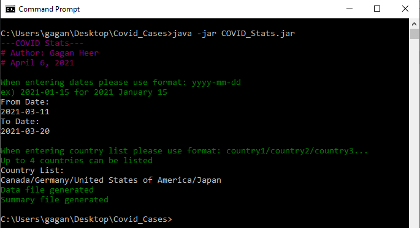
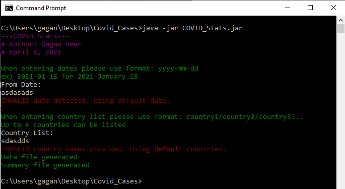
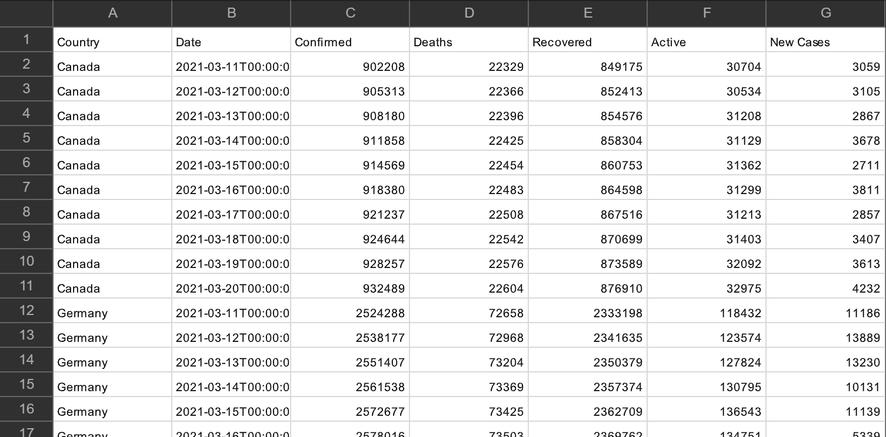
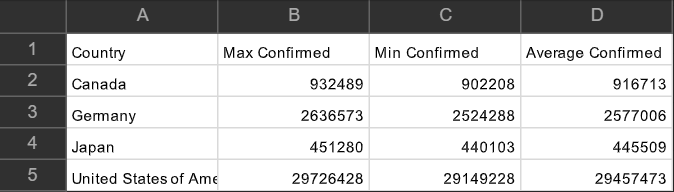

# COVID Stats

Command line java program that creates CSV files which contain the COVID stats for the requested countries during a specific time period. Up to 4 different countries can be requested at once  

When dates/country names are input they are required to be valid and fit the specified format or default inputs are used in place  

The data.csv file created group together country data, sorts by date and displays the number of: confirmed COVID cases, deaths related to COVID,  people that have recovered from COVID, people that actively have COVID and the number of new cases since the last day  

The summary.csv file displays the max confirmed, min confirmed and average confirmed COVID cases for a country, based on the time period that was input  
